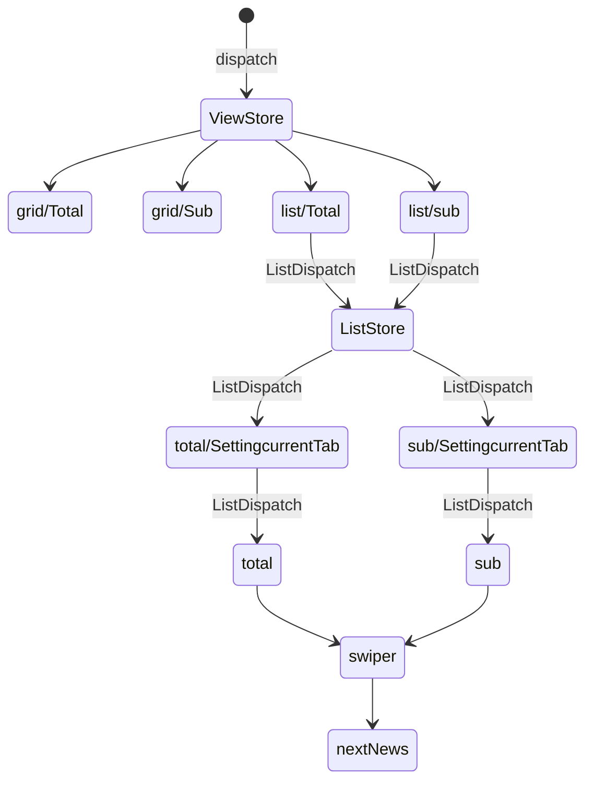

# 🗞️fe-newsstand

> [기획서](https://www.figma.com/design/SJHhyw3G0A4qDSWMIo9Ths/FE_%EB%89%B4%EC%8A%A4%EC%8A%A4%ED%83%A0%EB%93%9C?node-id=11101-21659&node-type=FRAME)

## 🤔고민한 것들 / 깨달은 점 / 메모

📝[위키](https://github.com/mi-hye/fe-newsstand/wiki/%ED%94%84%EB%A1%9C%EC%A0%9D%ED%8A%B8%EB%A5%BC-%EC%A7%84%ED%96%89%ED%95%98%EB%A9%B4%EC%84%9C-%ED%95%9C-%EA%B8%B0%EB%A1%9D)

## 🧹상태관리

---

## 🚩구현 목록

- [x] 1. 기본화면
- [x] 2. 최신 뉴스 자동 롤링 영역
- [x] 3. 전체 언론사 : 그리드 보기
- [x] 4. 전체 언론사 : 리스트 보기
- [x] 5. 내가 구독한 언론사 : 리스트 보기
- [x] 6. 내가 구독한 언론사 : 그리드 보기
- [x] 7. 추가 미션 : 다크모드

### 📝요구사항

#### 1.기본 화면

- [x] 기본 상단 영역, 뉴스스탠드 로고, 시스템 날짜 표시
- [x] 최신 뉴스 자동롤링
- [x] 언론사별 기사들을 확인하는 영역 , `전체 언론사` 탭의 `그리드보기`를 기본 상태로 한다

#### 2.최신 뉴스자동 롤링

- [x] 왼쪽 바와 오른쪽 바는 각각 다른 최신 뉴스 헤드라인 5개가 5초마다 무한롤링
- [x] 좌우 영역을 1초가이 간격
- [x] 마우스 호버시 일시정지, 헤드라인에 밑줄 표시

#### 전체언론사

##### 3.그리드 보기

- [x] 6\*4의 테이블이 들어가도록 한다
- ~~[ ] 언론사 새로고침 시 랜덤 배치~~
- [x] 그리드의 좌우에는 화살표 배치, 페이지 넘김
- [x] 가장첫&끝페이지 화살표 제거
- [x] 각 언론사 마크에 마우스를 올리면 `구독하기` 버튼 표시
- [x] 이미 구독하고 있는 언론사의 경우 `해지하기` 표시
- [x] 알럿

##### 4.리스트보기

- [x] 각 분야 카테고리 기사 표시
- [x] 선택된 카테고리 이름 옆에는 헤당 카테고리에 속해있는 언론사의 갯수와 현재 언론사의 순서를 표시
- ~~[ ] 언론사의 순서는 화면이 새로고침 될 때 마다 랜덤~~
- [x] 프로그래스바
- [x] 좌우 화살표를 누르면 다음, 이전 언론사로 넘어갈 수 있다
- [x] 가장 마지막 카테고리의 마지막 언론사가 보여진 후에는 처음 카테로리로 넘어간다
- [x] 메인 뉴스에 마우스를 올리면 섬네일은 5% 확대 되고 뉴스 타이틀에는 밑줄이 생기도록 한다.
- [x] 구독하기 버튼을 누르면 `내가 구독한 언론사`에 추가 되었습니다라는 스낵바가 5초 유지된 후 `즉시 내가 구독한 언론사 탭의 리스트 보기로 화면`으로 이동한다

#### 내가 구독한 언론사

##### 5.리스트보기

- ~~[ ] 구독한 언론사 탭 상태는 리스트 보기가 기본~~
- [x] 내가 구독한 언론사의 리스트 보기 화면은 전체 언론사의 리스트보기와 동일하되, 카테고리들이 나열되어있던 가로 탭에 언론사의 이름과 > 화살표 아이콘이 보이도록 한다
- [x] 언론사가 많아서 탭의 가로 영역을 넘어가는 경우, 드래그로 가로스크롤
- [x] 언론사는 구독한 순서대로 배치
- [x] `구독해지`버튼을 누르면 `{언론사이름}을(를) 구독 해지하겠습니까?`라는 알럿이 뜨고록 한다
- [x] 각 알럿 버튼에도 마우스를 올리면 밑줄이 생긴다.
- [x] `예, 해지합니다`를 선택하면 즉시 구독이 해지되고 목록의 다음 순서 언론사가 바로 나타나도록 한다.

##### 6.그리드 보기

- [x] 전체 언론사의 그리드보기와 동일하나 구독을 누른 브랜드 마크만 보이고 나머지 칸은 비어있도록 한다.
- [x] 구독중인 언론사의 브랜드 마크 셀에 마우스를 올리면 구독해지 버튼이 나타난다
- [x] 알럿은 리스트 보기와 동일

#### 7.추가 미션 다크모드

- [x] foundation의 컬러 팔레트 정보를 활용해 다크 모드 테마를 자율적으로 만들어보자

#### 🌟**밑줄이 그어진 요구사항은 설계를 다른 방향으로 해서 구현 할 수 없었던 요구사항들이다. 그리드와 리스트의 구독을 각각 별개의 것으로 생각했고 그리드에선 구독을 하면 현재 페이지의 1페이지로 돌아가고 리스트에선 구독한 화면으로 이동한다.**

---
