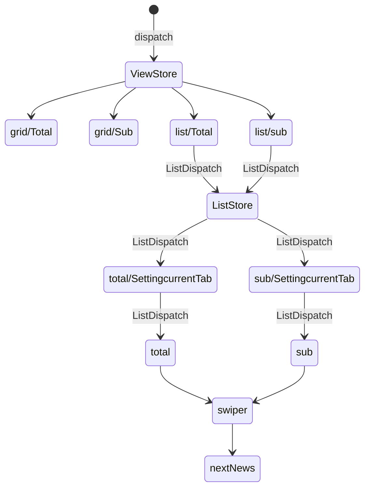

# 🗞️fe-newsstand

> [기획서](https://www.figma.com/design/SJHhyw3G0A4qDSWMIo9Ths/FE_%EB%89%B4%EC%8A%A4%EC%8A%A4%ED%83%A0%EB%93%9C?node-id=11101-21659&node-type=FRAME)

# 🧹상태관리



---

## 🚩구현 목록

- [x] 1. 기본화면
- [x] 2. 최신 뉴스 자동 롤링 영역
- [x] 3. 전체 언론사 : 그리드 보기
- [x] 4. 전체 언론사 : 리스트 보기
- [x] 5. 내가 구독한 언론사 : 리스트 보기
- [x] 6. 내가 구독한 언론사 : 그리드 보기
- [x] 7. 추가 미션 : 다크모드

### 📝요구사항

#### 1.기본 화면

- [x] 기본 상단 영역, 뉴스스탠드 로고, 시스템 날짜 표시
- [x] 최신 뉴스 자동롤링
- [x] 언론사별 기사들을 확인하는 영역 , `전체 언론사` 탭의 `그리드보기`를 기본 상태로 한다

#### 2.최신 뉴스자동 롤링

- [x] 왼쪽 바와 오른쪽 바는 각각 다른 최신 뉴스 헤드라인 5개가 5초마다 무한롤링
- [x] 좌우 영역을 1초가이 간격
- [x] 마우스 호버시 일시정지, 헤드라인에 밑줄 표시

#### 전체언론사

##### 3.그리드 보기

- [x] 6\*4의 테이블이 들어가도록 한다
- ~~[ ] 언론사 새로고침 시 랜덤 배치~~
- [x] 그리드의 좌우에는 화살표 배치, 페이지 넘김
- [x] 가장첫&끝페이지 화살표 제거
- [x] 각 언론사 마크에 마우스를 올리면 `구독하기` 버튼 표시
- [x] 이미 구독하고 있는 언론사의 경우 `해지하기` 표시
- [x] 알럿

##### 4.리스트보기

- [x] 각 분야 카테고리 기사 표시
- [x] 선택된 카테고리 이름 옆에는 헤당 카테고리에 속해있는 언론사의 갯수와 현재 언론사의 순서를 표시
- ~~[ ] 언론사의 순서는 화면이 새로고침 될 때 마다 랜덤~~
- [x] 프로그래스바
- [x] 좌우 화살표를 누르면 다음, 이전 언론사로 넘어갈 수 있다
- [x] 가장 마지막 카테고리의 마지막 언론사가 보여진 후에는 처음 카테로리로 넘어간다
- [x] 메인 뉴스에 마우스를 올리면 섬네일은 5% 확대 되고 뉴스 타이틀에는 밑줄이 생기도록 한다.
- [x] 구독하기 버튼을 누르면 `내가 구독한 언론사`에 추가 되었습니다라는 스낵바가 5초 유지된 후 `즉시 내가 구독한 언론사 탭의 리스트 보기로 화면`으로 이동한다

#### 내가 구독한 언론사

##### 5.리스트보기

- ~~[ ] 구독한 언론사 탭 상태는 리스트 보기가 기본~~
- [x] 내가 구독한 언론사의 리스트 보기 화면은 전체 언론사의 리스트보기와 동일하되, 카테고리들이 나열되어있던 가로 탭에 언론사의 이름과 > 화살표 아이콘이 보이도록 한다
- [x] 언론사가 많아서 탭의 가로 영역을 넘어가는 경우, 드래그로 가로스크롤
- [x] 언론사는 구독한 순서대로 배치
- [x] `구독해지`버튼을 누르면 `{언론사이름}을(를) 구독 해지하겠습니까?`라는 알럿이 뜨고록 한다
- [x] 각 알럿 버튼에도 마우스를 올리면 밑줄이 생긴다.
- [x] `예, 해지합니다`를 선택하면 즉시 구독이 해지되고 목록의 다음 순서 언론사가 바로 나타나도록 한다.

##### 6.그리드 보기

- [x] 전체 언론사의 그리드보기와 동일하나 구독을 누른 브랜드 마크만 보이고 나머지 칸은 비어있도록 한다.
- [x] 구독중인 언론사의 브랜드 마크 셀에 마우스를 올리면 구독해지 버튼이 나타난다
- [x] 알럿은 리스트 보기와 동일

#### 7.추가 미션 다크모드

- [x] foundation의 컬러 팔레트 정보를 활용해 다크 모드 테마를 자율적으로 만들어보자

#### 🌟**밑줄이 그어진 요구사항은 설계를 다른 방향으로 해서 구현 할 수 없었던 요구사항들이다. 그리드와 리스트의 구독을 각각 별개의 것으로 생각했고 그리드에선 구독을 하면 현재 페이지의 1페이지로 돌아가고 리스트에선 구독한 화면으로 이동한다.**

---

## 🤔고민한 것들 / 깨달은 점

#### **0.`설계`**

> 요구사항을 잘 읽자.
> 적어도 설계를 80%는 하고 코딩을 시작하자

#### 1.크롤링

1. nodejs에서 puppeteer를 이용해 동적 웹사이트의 요소를 크롤링
   - nodejs에선 dom에 접근할 수 없다. 따라서 함수를 이용해 브라우저에게 전달 후 브라우저가 함수를 실행시켜서 그 결과를 node에서 사용
   - puppeteer에서 가져온 브라우저의 page의 evaluate함수를 사용하면 함수 내에서는 dom객체를 이용할 수 있다.
2. 크롤링 한 결과를 js 모듈을 이용해 JSON형태로 저장
3. 저장한 JSON을 웹사이트의 화면을 그릴때 js에서 읽어들여 화면에 배치

#### 2.롤링 배너

- tag 1개로만 할 수 있을 것 같아서 해봤더니 잘 동작은 하나, 움직일때 hover시 부자연스러움이 있음
- 나중에는 2개로 구현하자....

#### 3.애니메이션 덮어쓰기

- tag에 class를 삭제하고 다시 주면 애니메이션이 처음부터 재생될줄 알았는데 그냥 그대로 쭉 재생 되었다.
  요소의 레이아웃이 변경된 걸 브라우저가 알아채지 못하기 때문
- void animation.offsetWidth;을 이용하니 원하는대로 애니메이션이 끊겨서 보였다 이하 설명

```
Reflow는 HTML 요소의 레이아웃을 다시 계산하는 프로세스를 가리킵니다. 브라우저는 HTML 문서를 렌더링할 때 요소의 크기, 위치, 스타일 등을 계산하고 배치하는데, 이때 요소의 레이아웃이 변경되거나 변경될 가능성이 있는 경우 브라우저는 해당 요소와 그 자식 요소의 레이아웃을 다시 계산합니다.

이때 요소의 레이아웃을 변경하면 브라우저가 다시 계산하고 다시 그리는데, 이를 Reflow라고 합니다. Reflow는 성능에 영향을 미치는 비용이 높은 작업 중 하나이므로 최소화하는 것이 좋습니다.

예를 들어, 요소의 너비나 높이, 위치, 보이기/숨기기 상태 등을 변경하면 Reflow가 발생합니다. 앞서 언급한 void animation.offsetWidth; 구문은 이러한 Reflow를 강제로 발생시키는 기술 중 하나입니다. 해당 요소의 너비 값을 읽어오는 것으로, 읽어오는 동시에 레이아웃을 재계산하고 다시 렌더링하는 효과가 있습니다. 이를 통해 애니메이션이 새로 시작될 때 애니메이션이 처음부터 재생되는 것을 보장할 수 있습니다.

void animation.offsetWidth를 사용하는 것은 일종의 트릭으로, 해당 요소의 너비 값을 읽어오는 것으로서, 브라우저에게 해당 요소의 레이아웃을 다시 계산하도록 유도합니다. 이는 애니메이션을 처음부터 다시 시작하는 데 도움이 됩니다.

만약 void animation.offsetWidth를 사용하지 않고 애니메이션 클래스를 제거하고 다시 추가한다면, 브라우저는 애니메이션 클래스를 제거하고 추가하는 것을 볼 뿐입니다. 그러나 요소의 레이아웃이 변경되지 않기 때문에 애니메이션이 새로 시작되지 않습니다.

따라서 void animation.offsetWidth를 사용하면 요소의 레이아웃이 변경되어 애니메이션이 처음부터 다시 시작됩니다. 이것은 강제로 Reflow를 발생시키는 효과를 줍니다.

하지만 void animation.offsetWidth는 단순한 트릭이며, 성능상의 부담이 있을 수 있습니다. 대부분의 경우에는 void animation.offsetWidth를 사용하지 않고도 애니메이션을 다시 시작할 수 있습니다. 다만, 이 경우에는 약간의 딜레이가 있을 수 있습니다.
```

---

### 🗒️메모

- 템플릿 리터럴을 이용해서 innerHtml의 프로퍼티에 부여하면 jsx처럼 사용할 수 있다

```
str += `<div>태그 추가</div>`;
tag.innerHTML=str;
```

- text-overflow 속성이 효력을 갖기 위해선 반드시 블록 레벨 컨테이너의 높이(height 또는 max-height)를 설정하거나, white-space를 nowrap으로 설정해야 한다!(mdn참조)

  - text-overflow 는 block container elements만 적용이 됨
  - `...`시키고 싶은 본인에게 ellipsis와 width를 부여해야함

- first-child , last-child => 해당 클래스를 가진 요소 중에서 첫 번째와 마지막 요소에만 스타일을 적용할 것으로 예상할 수 있지만, 실제로는 `해당 클래스를 가진 요소가 문서 내에서 각각 첫 번째와 마지막 자식 요소일 때에만` 스타일을 적용합니다. 즉, 이 선택자는 요소가 첫 번째 자식 요소이거나 마지막 자식 요소일 때에만 적용되는 것이지 해당 클래스를 가진 요소 중에서 첫 번째와 마지막 요소를 선택하는 것이 아닙니다.

- width에 transition을 할 때 padding을 이용하면 원래 요소의 width는 건들지 않고 늘어나는 것처럼 보인다!!

- 애니메이션 멈추는 속성이 있음 animation-play-state:paused;

- 가상요소 :after, :before 같은 요소는 실제 dom에 그려진 애가 아니다 따라서 속성을 변경 시킬 수 없음

```
getComputedStyle() 함수는 컴퓨테이션된 스타일을 반환합니다. 따라서 이를 변수 a에 저장하면 실제로 CSS 스타일이 아닌 컴퓨테이션된 스타일 객체가 됩니다. 이 객체는 CSS 속성을 포함하고 있지만, 이러한 속성들은 읽기 전용이므로 수정할 수 없습니다.
```

- 리펙토링을 시작할 때는 브랜치 생성하자...

- 마우스 휠 Event wheel
  - deltaX 속성: X축 기준 마우스휠 스크롤량
  - deltaY 속성: Y축 기준 마우스휠 스크롤량(위로 스크롤하면 -, 아래로 스크롤하면 +)
  - element.scrollLeft: 가로 스크롤 위치를 가져오거나 설정하는 속성
  - 속도를 조절하려면 deltaY값을 조정하면 된다
  ```
  const scroll = document.querySelector(".press__list__nav");
  	scroll.addEventListener("wheel", (e) => {
  		e.preventDefault();
  		scroll.scrollLeft += e.deltaY > 0 ? e.deltaY - LIST.wheelSpeed : e.deltaY + LIST.wheelSpeed;
  	});
  ```
